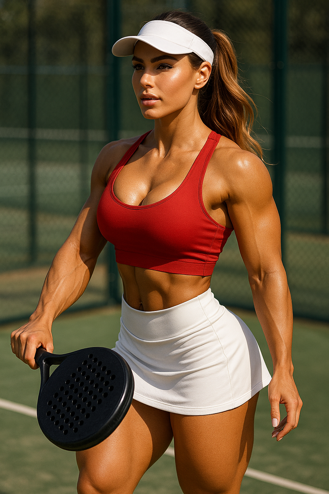

# 📘 AAE Guide / Vodič kroz Aesthetic Art Ekt

---

## 🇬🇧 What is AAE?

**AAE (Aesthetic Art Ekt)** is a visual prompt standard for artistic AI image generation.  
It is not NSFW. It is not generic.  
It's a balance of sensual, disciplined, and narrative visual expression – focused on the body, light, and emotion.

AAE images reflect strength, contemplation, and the beauty of the female form without exploitation.

---

## 🇷🇸 Šta je AAE?

**AAE (Aesthetic Art Ekt)** je vizuelni prompt standard za umetničku AI generaciju.  
Ne spada u NSFW. Ne spada u generičko.  
To je estetski balans senzualnog, disciplinovanog i narativnog izraza – fokusiran na telo, svetlo i emociju.

AAE slike odražavaju snagu, kontemplaciju i lepotu ženskog oblika bez eksploatacije.

---

## 🇬🇧 Syntax examples / 🇷🇸 Sintaksa primera

### Tag format

- `AAE` – prefix (standard)
- `WTRWND` – ambience clue (*water + window*)
- `MSCN` – mood/scene (*moody scene*)
- `VLU84` – verzija/hash

---

### Prompt example

**English**  
`Ultra-realistic portrait of an athletic woman, backlit by warm rain through a window, towel draped, soft shadows.`

**Srpski**  
`Ultra-realističan portret atletske žene, pozadinsko toplo kišno svetlo kroz prozor, peškir prebačen, meke senke.`

**How to use / Kako se koristi**
- Tag ide u *caption* ili na početak prompta.
- Prompt opis ostaje čitljiv AI modelima.
- Zajedno grade AAE kontekst (estetski, nenapadan, nije NSFW).

---

# 🖼️ Example images / Primeri slika

Here is an example image with AAE tags:

**EN:** Ultra-realistic full-body portrait of an athletic woman, sun-kissed skin, defined muscles, soft natural light.  
**SR:** Ultra-realističan portret atletske žene, preplanula koža, definisani mišići, meko prirodno svetlo.

**AAE tag:** `AAE-SUNKSD-OLYM-FB01`

---

**EN:** Ultra-realistic full-body portrait of Talia Rise, sun-kissed, athletic, red crop top, white mini skirt, playing padel, sun visor.  
**SR:** Realističan portret Talije Rajz, preplanula, atletska, crveni crop top, bela mini suknja, igra padel, ima sun visor na glavi.

**AAE tag:** `AAE-SUNKSD-OLYM-FB03-PADEL`

---

## 🇬🇧 Best-practice rules / 🇷🇸 Pravila dobrog ukusa

1. **Respect the balance**  
   - EN: Always pair the AAE tag with a descriptive prompt that stays artistic, not explicit.  
   - SR: AAE tag uvek ide uz opis koji ostaje umetnički, ne eksplicitan.
2. **Focus on light & mood**  
   - EN: Use ambience clues (e.g. `WTRWND`, `GLDHOUR`) to hint lighting instead of writing camera jargon.  
   - SR: Koristi ambijentalne oznake (npr. `WTRWND`, `GLDHOUR`) umesto tehničkog žargona o objektivima.
3. **One tag per image**  
   - EN: Don’t chain multiple AAE tags—pick the most relevant.  
   - SR: Ne kači više AAE tagova za jednu sliku—dovoljan je jedan, najbitniji.
4. **Keep it inclusive**  
   - EN: Avoid stereotypes about body, gender, or culture.  
   - SR: Izbegavaj stereotipe o telu, polu ili kulturi.
5. **Credit & share**  
   - EN: When you post, add `#AAE` so others can find the standard.  
   - SR: Kad objavljuješ, dodaj `#AAE` da zajednica lakše pronađe standard.

---

## License

- EN: AAE is released under MIT License – free to use, fork, and improve.
- SR: AAE je objavljen pod MIT licencom – slobodno koristiti, forkovati i unapređivati.

