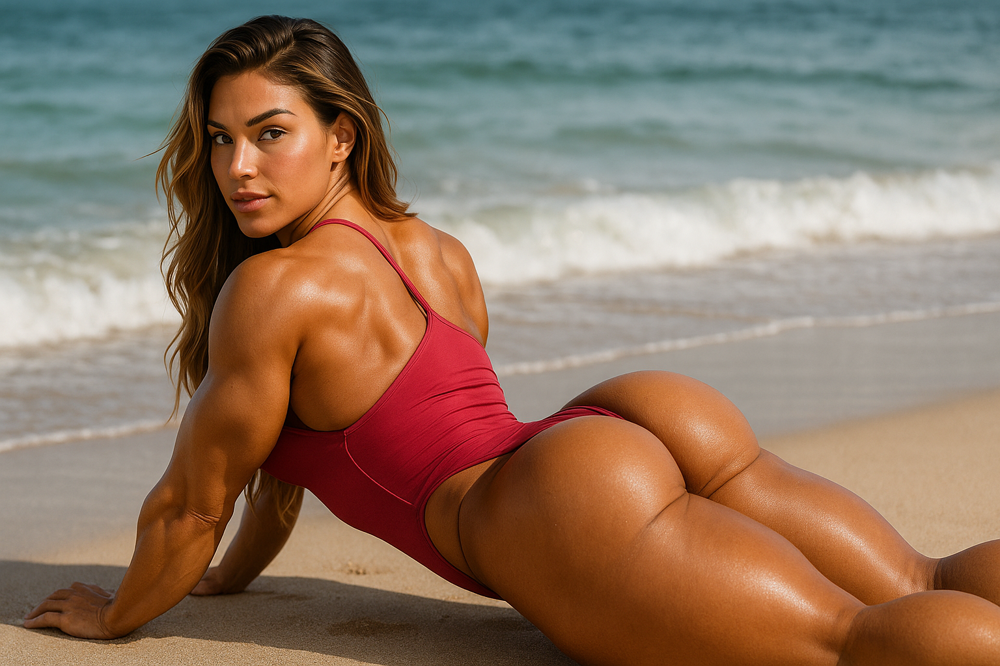

  

Dobrodošao u **AAE Standard** 🌟  

*Welcome to the **AAE Standard** 🌟*

Ovaj sajt dokumentuje **Aesthetic Art Ekt (AAE)** – vizuelni prompt-standard za AI generaciju slika.

> **AAE standard = balans senzualnog i narativnog izraza, fokus na telo, svetlo i emociju.**  
> Ne spada u NSFW ni generičke stock-fotke.

---

## 📂 Navigacija

📸 [Pogledaj celu galeriju slika →](examples.md)

Galerija sadrži sve generisane AAE slike sa opisima, tagovima i datumima.  
Automatski se ažurira svaki put kada pokreneš `generate_examples_md.py` 

- **[Primeri slika](examples.md)** – kompletna galerija sa tagovima  
- **[O projektu](about.md)** – motivacija, manifest &amp; istorija  
- **[manifest.json](manifest.json)** – sirovi podaci o svakoj slici  
- **[LICENSE](LICENSE)** – MIT licenca repozitorijuma  

  <a href="examples.md">⬇️ Idemo na primere</a>

---

© 2025 Milan Tegeltija • Repo je Open Source  
Izgrađeno pomoću GitHub Pages + Jekyll

